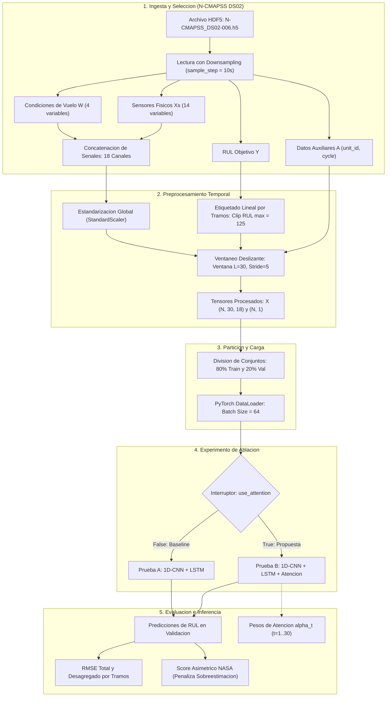
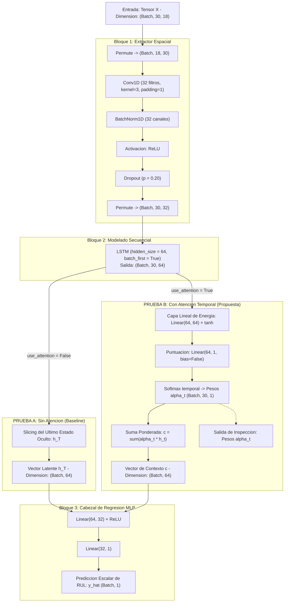

# Diagramas de Mantenimiento Predictivo (N-CMAPSS DS02)

## 1. Pipeline de Datos, Modelado y Evaluación

```mermaid
flowchart TD
    subgraph S1["1. Ingesta y Seleccion (N-CMAPSS DS02)"]
        A["Archivo HDF5: N-CMAPSS_DS02-006.h5"] --> B["Lectura con Downsampling (sample_step = 10s)"]
        B --> C["Condiciones de Vuelo W (4 variables)"]
        B --> D["Sensores Fisicos Xs (14 variables)"]
        B --> E["RUL Objetivo Y"]
        B --> F["Datos Auxiliares A (unit_id, cycle)"]
        C --> G["Concatenacion de Senales: 18 Canales"]
        D --> G
    end

    subgraph S2["2. Preprocesamiento Temporal"]
        G --> H["Estandarizacion Global (StandardScaler)"]
        E --> I["Etiquetado Lineal por Tramos: Clip RUL max = 125"]
        H --> J["Ventaneo Deslizante: Ventana L=30, Stride=5"]
        I --> J
        F --> J
        J --> K["Tensores Procesados: X (N, 30, 18) y (N, 1)"]
    end

    subgraph S3["3. Particion y Carga"]
        K --> L["Division de Conjuntos: 80% Train y 20% Val"]
        L --> M["PyTorch DataLoader: Batch Size = 64"]
    end

    subgraph S4["4. Experimento de Ablacion"]
        M --> N{Interruptor: use_attention}
        N -->|False: Baseline| O["Prueba A: 1D-CNN + LSTM"]
        N -->|True: Propuesta| P["Prueba B: 1D-CNN + LSTM + Atencion"]
    end

    subgraph S5["5. Evaluacion e Inferencia"]
        O --> Q["Predicciones de RUL en Validacion"]
        P --> Q
        Q --> R["RMSE Total y Desagregado por Tramos"]
        Q --> S["Score Asimetrico NASA (Penaliza Sobreestimacion)"]
        P -.-> T["Pesos de Atencion alpha_t (t=1..30)"]
    end
```

---

## 2. Arquitecturas de las Pruebas de Ablación

```mermaid
flowchart TD
    IN["Entrada: Tensor X - Dimension: (Batch, 30, 18)"]
    
    subgraph BlqConv["Bloque 1: Extractor Espacial"]
        P1["Permute -> (Batch, 18, 30)"]
        C1["Conv1D (32 filtros, kernel=3, padding=1)"]
        BN["BatchNorm1D (32 canales)"]
        ACT1["Activacion: ReLU"]
        DO["Dropout (p = 0.20)"]
        P2["Permute -> (Batch, 30, 32)"]
    end

    subgraph BlqRec["Bloque 2: Modelado Secuencial"]
        LSTM["LSTM (hidden_size = 64, batch_first = True)<br/>Salida: (Batch, 30, 64)"]
    end

    IN --> P1 --> C1 --> BN --> ACT1 --> DO --> P2 --> LSTM

    subgraph RamaA["PRUEBA A: Sin Atencion (Baseline)"]
        SL["Slicing del Ultimo Estado Oculto: h_T"]
        V_A["Vector Latente h_T - Dimension: (Batch, 64)"]
        SL --> V_A
    end

    subgraph RamaB["PRUEBA B: Con Atencion Temporal (Propuesta)"]
        E1["Capa Lineal de Energia: Linear(64, 64) + tanh"]
        E2["Puntuacion: Linear(64, 1, bias=False)"]
        SM["Softmax temporal -> Pesos alpha_t (Batch, 30, 1)"]
        SUM["Suma Ponderada: c = sum(alpha_t * h_t)"]
        V_B["Vector de Contexto c - Dimension: (Batch, 64)"]
        W_OUT["Salida de Inspeccion: Pesos alpha_t"]
        E1 --> E2 --> SM --> SUM --> V_B
        SM -.-> W_OUT
    end

    LSTM -->|use_attention = False| SL
    LSTM -->|use_attention = True| E1

    subgraph BlqReg["Bloque 3: Cabezal de Regresion MLP"]
        FC1["Linear(64, 32) + ReLU"]
        FC2["Linear(32, 1)"]
        RUL["Prediccion Escalar de RUL: y_hat (Batch, 1)"]
        FC1 --> FC2 --> RUL
    end

    V_A --> FC1
    V_B --> FC1
```