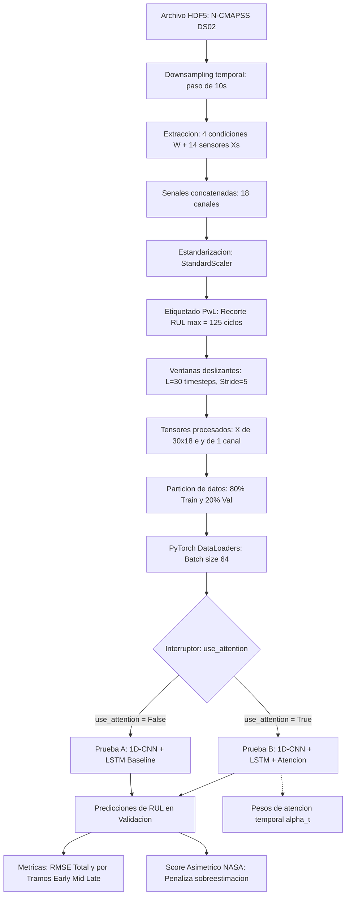
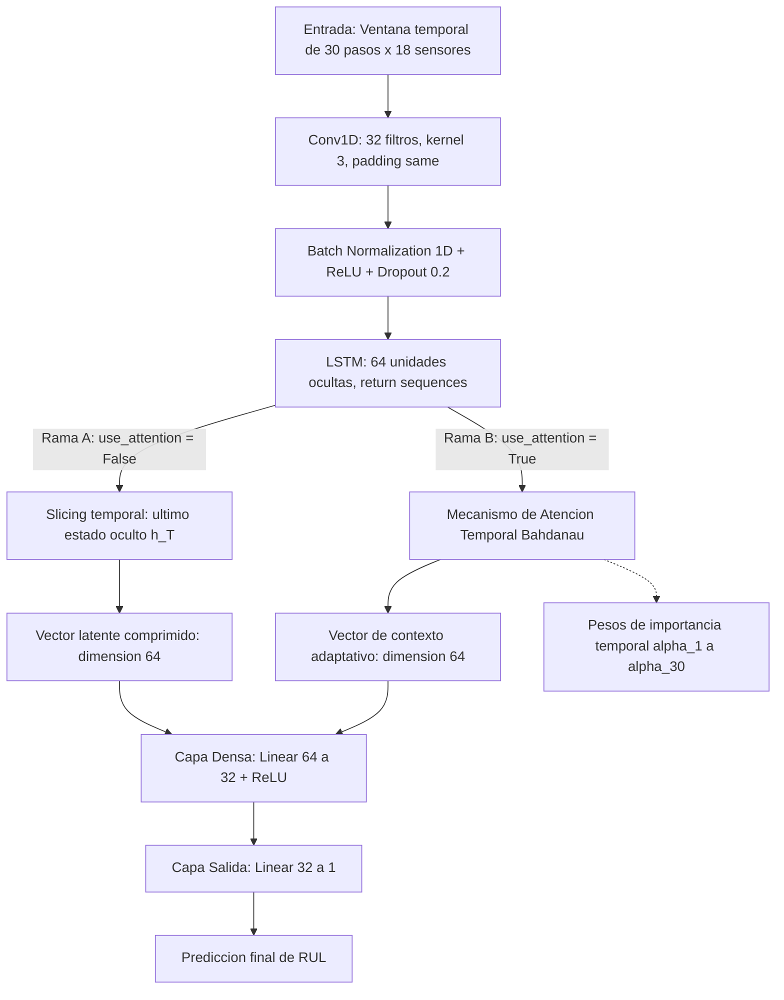

# Diagramas de Mantenimiento Predictivo (N-CMAPSS DS02)

## 1. Pipeline de Datos, Modelado y Evaluacion

```mermaid
flowchart TD
    A[Archivo HDF5: N-CMAPSS DS02] --> B[Downsampling temporal: paso de 10s]
    B --> C[Extraccion: 4 condiciones W + 14 sensores Xs]
    C --> D[Senales concatenadas: 18 canales]
    D --> E[Estandarizacion: StandardScaler]
    E --> F[Etiquetado PwL: Recorte RUL max = 125 ciclos]
    F --> G[Ventanas deslizantes: L=30 timesteps, Stride=5]
    G --> H[Tensores procesados: X de 30x18 e y de 1 canal]
    H --> I[Particion de datos: 80% Train y 20% Val]
    I --> J[PyTorch DataLoaders: Batch size 64]
    
    J --> K{Interruptor: use_attention}
    
    K -->|use_attention = False| L[Prueba A: 1D-CNN + LSTM Baseline]
    K -->|use_attention = True| M[Prueba B: 1D-CNN + LSTM + Atencion]
    
    L --> N[Predicciones de RUL en Validacion]
    M --> N
    
    N --> O[Metricas: RMSE Total y por Tramos Early Mid Late]
    N --> P[Score Asimetrico NASA: Penaliza sobreestimacion]
    M -.-> Q[Pesos de atencion temporal alpha_t]
```

---

## 2. Arquitecturas de las Pruebas de Ablacion

```mermaid
flowchart TD
    IN[Entrada: Ventana temporal de 30 pasos x 18 sensores] --> C1[Conv1D: 32 filtros, kernel 3, padding same]
    C1 --> BN[Batch Normalization 1D + ReLU + Dropout 0.2]
    BN --> LSTM[LSTM: 64 unidades ocultas, return sequences]

    LSTM -->|Rama A: use_attention = False| LAST[Slicing temporal: ultimo estado oculto h_T]
    LSTM -->|Rama B: use_attention = True| ATT[Mecanismo de Atencion Temporal Bahdanau]

    ATT --> CTX[Vector de contexto adaptativo: dimension 64]
    LAST --> HID[Vector latente comprimido: dimension 64]
    ATT -.-> W[Pesos de importancia temporal alpha_1 a alpha_30]

    HID --> FC1[Capa Densa: Linear 64 a 32 + ReLU]
    CTX --> FC1
    FC1 --> FC2[Capa Salida: Linear 32 a 1]
    FC2 --> OUT[Prediccion final de RUL]
```